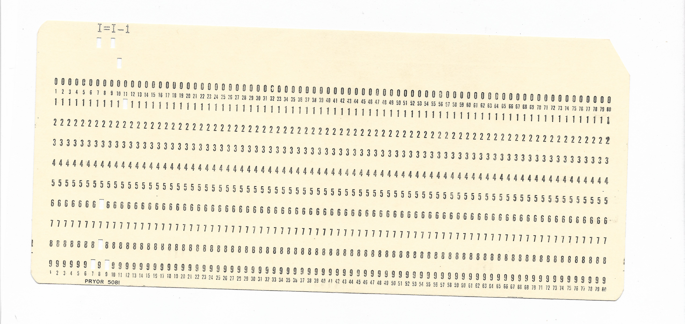

# Fortran Fragments

I recently got a lot of 10 FORTRAN 77 punch cards from eBay. \
In `FRAGMENTS.F` contains the code at the top of each punch card.

## Here are scans at 600dpi (last 2 1200dpi):
<table>
  <tr>
    <td valign="top"></td>
    <td valign="top"></td>
    <td valign="top"></td>
  </tr>
  <tr>
    <td valign="top"></td>
    <td valign="top"></td>
    <td valign="top"></td>
  </tr>
</table>